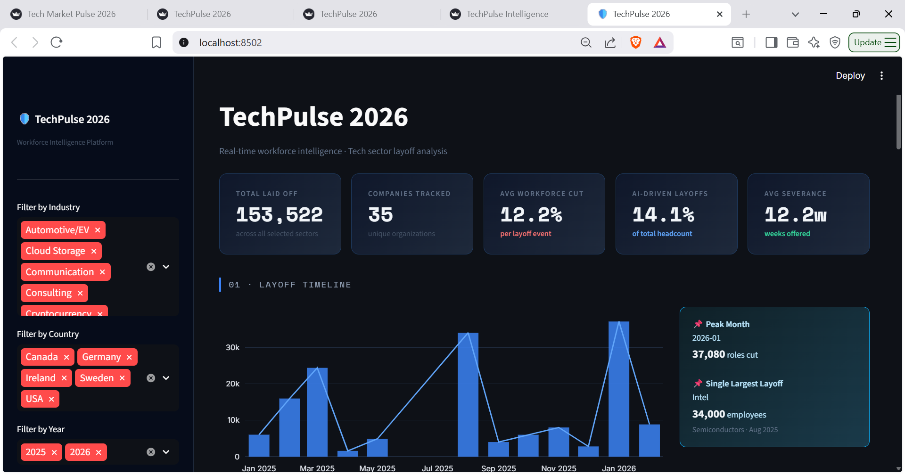
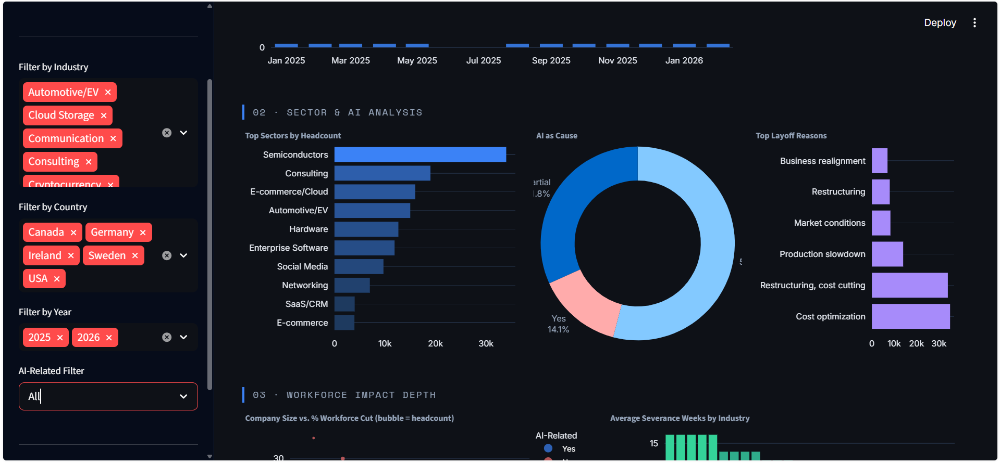
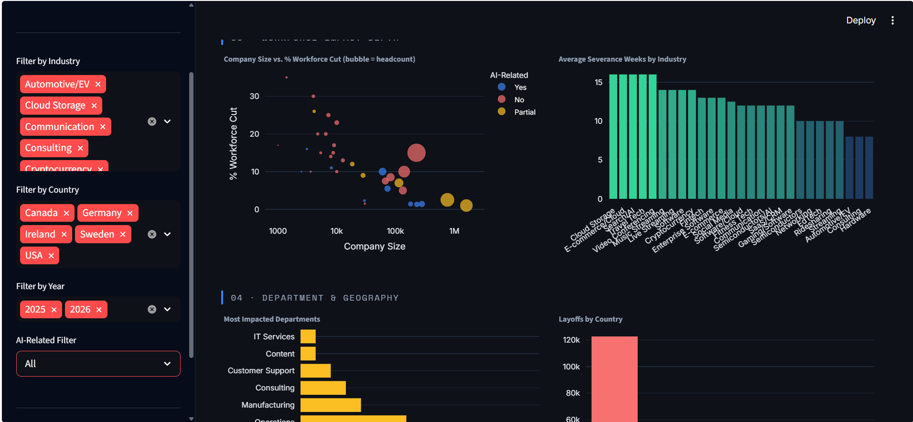
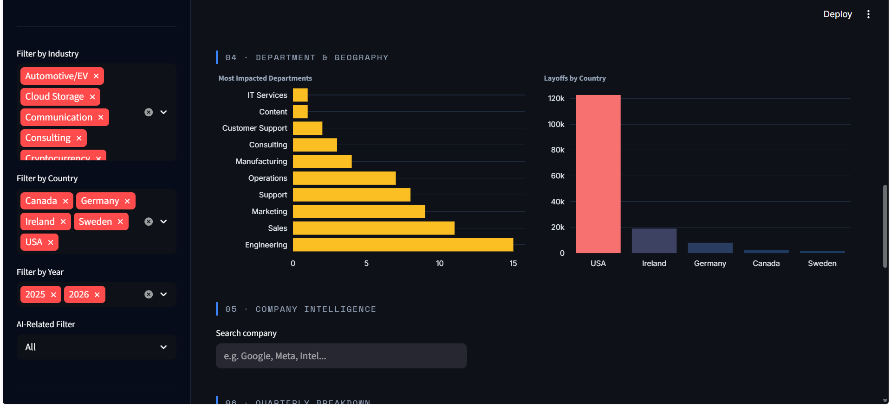
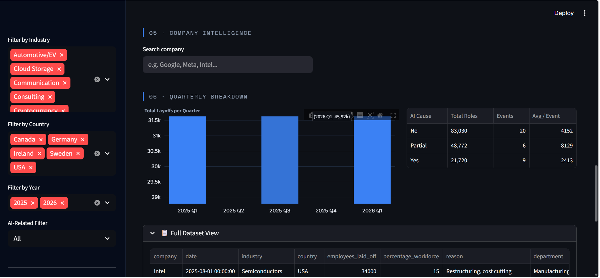
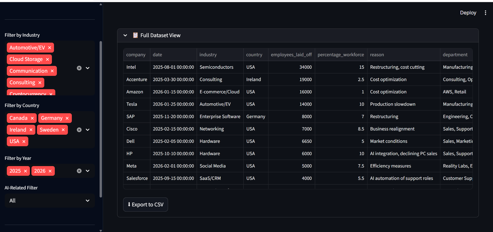

# 🛡️ TechPulse 2026 — Workforce Intelligence Platform

> Interactive analysis of tech sector layoffs across 35 companies (2025–2026)

Built by **Shivani Tomar** · Data Systems Analyst

---

## 📸 Dashboard Preview

### Hero — KPI Overview & Layoff Timeline


### Sector & AI Analysis


### Workforce Impact Depth — Scatter & Severance


### Department & Geography Breakdown


### Quarterly Breakdown & Company Intelligence


### Full Dataset View with Export


---

## 📌 What This Is

TechPulse is an interactive workforce intelligence dashboard analysing tech industry layoffs across 2025–2026. It tracks **153,522 impacted roles** across 35 companies, examines AI's role as a driver of job cuts, and surfaces patterns across sectors, departments, and geographies.

Built as a portfolio project demonstrating end-to-end data work — from raw CSV ingestion to a production-style interactive dashboard.

---

## 🧠 Key Questions This Answers

- Which sectors cut the most headcount, and why?
- Is AI automation actually driving layoffs, or is it a scapegoat?
- Which departments are most vulnerable?
- How does company size correlate with severity of cuts?
- Which companies offer the best severance, and which offer the least?

---

## 📊 Features

| Feature | Description |
|---|---|
| **Timeline Analysis** | Monthly layoff trends with peak month detection |
| **Sector Concentration** | Top industries ranked by total headcount impact |
| **AI Catalyst Analysis** | % of layoffs where AI was cited as the cause |
| **Scatter Analysis** | Company size vs. % workforce cut (bubble = headcount) |
| **Department Breakdown** | Most impacted job functions across all events |
| **Geography View** | Layoffs broken down by country |
| **Quarterly Breakdown** | Q1–Q4 2025 and Q1 2026 with AI summary table |
| **Company Drill-Down** | Search any company for full event detail card |
| **Severance Tracker** | Average severance weeks by industry |
| **Export to CSV** | Download filtered dataset directly from dashboard |

---

## 🗂️ Dataset

- **Source:** Kaggle — Tech Layoffs Dataset
- **Coverage:** 35 companies · Jan 2025 – Feb 2026
- **Fields:** Company, Date, Industry, Country, Employees Laid Off, Total Employees, % Workforce, Department, Reason, Severance Weeks, AI-Related flag
- **Note:** Dataset is curated for analytical and portfolio purposes.

---

## 🛠️ Tech Stack

| Tool | Purpose |
|---|---|
| Python 3.11 | Core language |
| Streamlit | Dashboard framework |
| Plotly | Interactive charts |
| SQLite | Local data layer |
| Pandas | Data transformation |

---

## 🚀 Run Locally

```bash
# 1. Clone the repo
git clone https://github.com/Shivani-Tomar08/TechPulse-2026.git
cd TechPulse-2026

# 2. Install dependencies
pip install streamlit plotly pandas

# 3. Build the database
python database_setup.py

# 4. Launch the dashboard
streamlit run app.py
```

Opens at `http://localhost:8501`

---

## 📁 Project Structure

```
TechPulse-2026/
├── data/
│   └── layoffs.csv
├── screenshots/
│   ├── 01_overview.png
│   ├── 02_sector_ai.png
│   ├── 03_workforce_depth.png
│   ├── 04_department_geo.png
│   ├── 05_quarterly_company.png
│   └── 06_dataset_export.png
├── app.py
├── database_setup.py
├── layoffs.db
├── .gitignore
└── README.md
```

---

## 💡 Design Decisions

- **SQLite over raw CSV** — simulates a real data pipeline; makes filtering efficient
- **Cached data loading** — `@st.cache_data` prevents redundant DB reads on every interaction
- **Pandas filtering over SQL string concat** — avoids SQL injection, reflects production standards
- **Department parsing** — raw comma-separated strings split and aggregated to show function-level impact
- **Consistent dark theme** — single cohesive design system throughout, no mixed themes

---

## 👩‍💻 Author

**Shivani Tomar**
Final Year IT Student · Data Systems Analyst
[GitHub](https://github.com/Shivani-Tomar08) · [LinkedIn](#)
